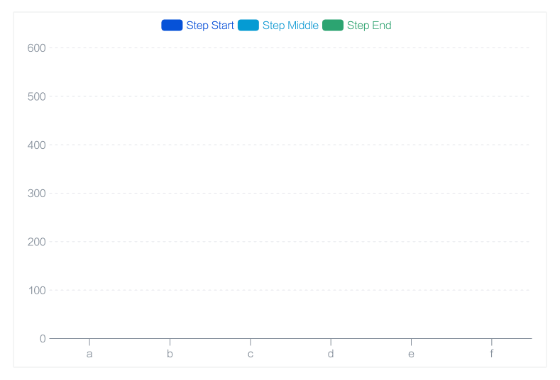

# advanced-charts [](https://github.com/awmleer/reto) [](https://www.npmjs.com/package/advanced-charts) [](https://www.npmjs.com/package/advanced-charts)



`advanced-charts` 是专门为前端框架 `React` 打造的高性能图表组件库。我们支持以 `JSX` 的形式简单的创建图形元素与图表组件。

 `advanced-charts` 提供了一套基础图形组件，开发者可以基于这套基础组件扩展符合自己需求的应用。在此基础之上，我们开发了大量常用的图表组件：柱状图、折线图、饼状图、K线图等供开发者直接在 `React` 项目中使用。

## 下载

执行如下指令可将 `advanced-charts` 下载到项目中

```bash
yarn add advanced-charts
```

## 使用

```ts
import { useState } from 'openinula'
import { Stage, Group, Rect, Circle } from 'advanced-charts'

function App() {
  return (
    <div>
      <button
        onClick={() => {
          setX(55)
        }}
      >
        setX
      </button>
      <Stage>
        <Group>
          <Rect x={120} y={10} width={100} height={100} fillStyle="blue" />
          <Rect x={180} y={10} width={100} height={100} fillStyle="red" />
        </Group>

        <Circle
          x={0}
          y={36}
          radius={30}
          fillStyle="red"
          cursor="pointer"
          onclick={() => {
            console.log(1234)
          }}
          onmouseenter={() => {
            console.log('enter')
          }}
        />
      </Stage>
    </div>
  )
}
```

### 快速开始

绘制一个矩形

```typescript
<Rect x={120} y={10} width={100} height={100} fillStyle="blue" />
```

# Stage 舞台参数

```tsx
import { Stage, Rect } from 'advanced-charts'

function App() {
  return (
    <Stage>
      <Rect x={10} y={10} width={100} height={100} fillStyle="red" />
    </Stage>
  )
}
```

# 图形参数

## 共有参数

```typescript
interface AbstractUiData {
  name?: string
  x?: number // Line 无此参数
  y?: number // Line 无此参数
  shadowColor?: string
  shadowBlur?: number
  shadowOffsetX?: number
  shadowOffsetY?: number
  lineWidth?: number
  opacity?: number // 透明度
  zIndex?: number // 同级顺序

  fillStyle?: CanvasFillStrokeStyles['fillStyle']
  strokeStyle?: CanvasFillStrokeStyles['strokeStyle']

  lineCap?: CanvasLineCap
  lineJoin?: CanvasLineJoin

  draggable?: boolean | 'horizontal' | 'vertical' // 是否可拖拽 | 只水平方向 | 只垂直方向
  cursor?: ICursor // 鼠标 hover 时的光标样式
}
```

## Rect 矩形，圆角矩形

```tsx
import { Rect } from 'advanced-charts'

function App() {
  return <Rect x={10} y={10} width={100} height={100} fillStyle="red" cornerRadius={4} />
}
```

## Circle 圆形，扇形，扇环

```tsx
import { Circle } from 'advanced-charts'

function App() {
  return (
    <>
      <Circle x={340} y={20} radius={30} fillStyle="green" />
      <Circle x={340} y={20} radius={30} innerRadius={20} fillStyle="pink" />
      <Circle x={340} y={20} radius={30} startAngle={20} endAngle={60} fillStyle="red" />
    </>
  )
}
```

## Line 线段，折线，曲线

```tsx
interface LineData extends AbstractUiData {
  path2D?: Path2D
  points?: number[] // [x1, y1, x2, y2, x3, y3 ...]
  closed?: boolean
  smooth?: boolean
  percent?: number // 0 - 1
}

function App() {
  return (
    <Stage>
      {/* 线段 */}
      <Line points={[10, 10, 50, 50]} strokeStyle="red" />

      {/* 曲线 */}
      <Line points={[10, 10, 50, 50, 80, 20]} smooth strokeStyle="red" />

      {/* 多边形 */}
      <Line points={[10, 10, 20, 50, 70, 60, 80, 20]} closed fillStyle="pink" strokeStyle="red"></Line>
    </Stage>
  )
}
```

## 组 Group（本身不渲染实际的图形，但事件冒泡可以传播到它）

```tsx
import { Group, Rect } from 'advanced-charts'

function App() {
  return (
    <Group>
      <Rect x={120} y={10} width={100} height={100} fillStyle="blue" />
      <Rect x={180} y={10} width={100} height={100} fillStyle="red" />
    </Group>
  )
}
```

## BoxHidden 盒子（渲染实际图形，参数与 Rect 一致）

只会在其内部显示, 超出部分不可见

```tsx
import { BoxHidden, Circle } from 'advanced-charts'

function App() {
  return (
    <BoxHidden x={330} y={10} width={100} height={100} fillStyle="pink">
      <Circle x={340} y={20} radius={30} fillStyle="green" draggable cursor="move" />
    </BoxHidden>
  )
}
```

rect 只会在 容器 的内部显示，超出部分会隐藏

## Text 文字

```tsx
import { Text } from 'advanced-charts'

interface TextData extends AbstractUiData {
  x: number
  y: number
  content: string
  fontSize?: number
  textAlign?: CanvasTextAlign
}

function App() {
  return <Text x={10} y={150} content="hello world"></Text>
}
```

# 更新图形

通过 `setState` 的方式, 即可更新图形并渲染 UI

```tsx
import { useState } from 'openinula'
import { Stage, Text } from 'advanced-charts'

function App() {
  const [x, setX] = useState(10)

  return (
    <div>
      <button onClick={() => setX(100)}>setX</button>

      <Stage>
        <Circle
          x={x}
          y={x}
          radius={20}
          fillStyle="red"
          cursor="pointer"
          animation={{ duration: 300, easing: 'linear' }}
        />
      </Stage>
    </div>
  )
}
```

# 拖拽

添加  `draggable` 属性即可拖拽

```tsx
import { Stage, Circle } from 'advanced-charts'

function App() {
  return (
    <Stage>
      <Circle x={x} y={x} radius={20} fillStyle="red" cursor="move" draggable />
    </Stage>
  )
}
```

对于 `Group` 或者 `BoxHidden` 这种有后代的元素，会找到拾取的图形的最近的 设置了 `draggable` 属性的图形作为拖拽目标，如果有后代元素，则后代元素跟着一起动。

# 事件

事件对象 `event` 格式

其中 `dx`, `dy` 为 `ondrag` 事件独有

```ts
type EventParameter = {
  target: IShape // 触发该事件的图形元素
  x: number // 鼠标位置 相对于 stage 左上角
  y: number // 鼠标位置 相对于 stage 左上角
  dx?: number // 鼠标的相对偏移量
  dy?: number // 鼠标的相对偏移量
  nativeEvent?: MouseEvent // js原生事件
}
```

```tsx
import { Stage, Rect } from 'advanced-charts'

function App() {
  const groupClick = evt => {
    console.log('group clicked')
  }

  const rectClick = evt => {
    console.log('rect clicked')
  }

  return (
    <Stage>
      <Group onclick={groupClick}>
        <Rect x={120} y={10} width={100} height={100} fillStyle="blue" onclick={rectClick} />
      </Group>
    </Stage>
  )
}
```

支持的事件

```typescript
type EventType = 'mouseleave' | 'mouseenter' | 'mousemove' | 'mousedown' | 'mouseup' | 'click'
```

- 支持后代元素的鼠标事件触发, 其行为与 DOM 表现一致
- 支持事件冒泡, 与 DOM 标准一致

设置了 `draggable: true` 的图形，额外有 `ondragstart` `ondrag` `ondragend` 事件，可用于自定义拖拽范围

# 动画

传入 `animation` 属性, 当重新 setState 的时候, 就可以执行动画

```tsx
import { Stage, Circle } from 'advanced-charts'

function App() {
  const [x, setX] = useState(36)

  return (
    <>
      <button onClick={() => setX(100)}>setX</button>

      <Stage>
        <Circle
          x={x}
          y={x}
          radius={20}
          fillStyle="red"
          cursor="pointer"
          animation={{ duration: 300, easing: 'linear' }}
        />
      </Stage>
    </>
  )
}
```